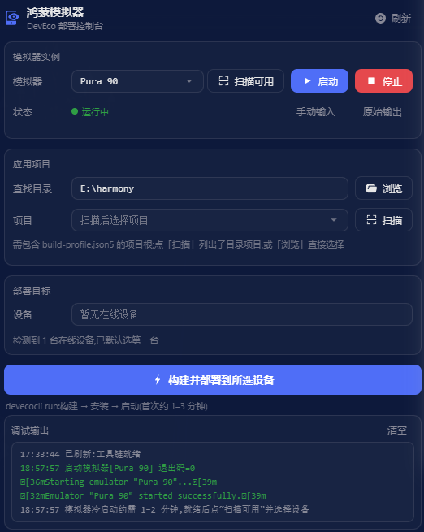

# 鸿蒙模拟器 · dsh-hmos-emulator

> DeepSeek Harness 侧边栏插件:一键启动鸿蒙模拟器,并将 HarmonyOS 应用构建、部署到模拟器。



## 能做什么

- **启动 / 停止模拟器**：一键启动或停止鸿蒙模拟器,自动列出可用实例与在线设备。
- **选择应用项目**：文件浏览或一键扫描,自动识别鸿蒙工程。
- **一键构建并部署**：将选定的应用构建、安装并启动到目标设备。
- **全程可见**：每一步的输出与状态实时显示,成功 / 失败一目了然。

## 依赖说明

本插件以「鸿蒙模拟器」标签页显示在侧边栏,依赖 [dsh-better-sidebar](https://github.com/omdsh-dev/DSH-better-sidebar);未安装时,请参考其说明安装。

## 安装

前置条件:

- 已安装 dsh 并正常运行(`dsh web`);Node.js ≥ 22(LTS 或更新)、pnpm ≥ 10。
- 已安装 DevEco Studio(提供模拟器、hdc 与 SDK)。
- 已安装 [`devecocli`](https://www.npmjs.com/package/@deveco/deveco-cli) 命令行工具;如未安装,执行 `npm i -g @deveco/deveco-cli`,或装好插件后在面板点击「一键安装 devecocli」。

### 方式一:npm 安装(推荐)

```sh
dsh plugin --profile web add dsh-hmos-emulator
```

### 方式二:从 GitHub 安装(免 npm)

```sh
dsh plugin --profile web add github:momo20012002/dsh-hmos-emulator
```

### 方式三:本地挂载(开发)

```sh
git clone https://github.com/momo20012002/dsh-hmos-emulator.git
cd dsh-hmos-emulator && pnpm install && pnpm build
dsh plugin --profile web add .
```

安装完成后,重启 `dsh web`(加载宿主端),再刷新浏览器页面(加载客户端),即可生效。

卸载:

```sh
dsh plugin --profile web remove dsh-hmos-emulator
```

## 使用

1. 打开侧边栏的 `+` 菜单 →「鸿蒙模拟器」。
2. 点击「扫描可用」列出模拟器与在线设备,再点击「启动」启动模拟器。
3. 在「应用项目」中浏览或扫描,选择鸿蒙工程。
4. 点击「构建并部署」,等待完成。

## 平台支持

- 模拟器(启动 / 停止)仅在 **Windows 与 macOS** 上可用——DevEco 官方模拟器不支持 Linux。
- 选择工程、连接设备、构建并部署在所有系统上均可用。

## 常见问题

| 现象 | 处理 |
|---|---|
| 启动时提示授权 / 协议未接受 | 在终端执行 `devecocli emulator license accept` 后重试 |
| 扫描不到模拟器实例 | 使用 DevEco Studio 的 Device Manager 确认实例存在,或在终端执行 `devecocli emulator list` 查看实际报错 |
| 部署失败但无具体报错 | 在工程中配置签名后重试;多入口模块工程暂不支持,请在终端手动构建部署 |
| 提示找不到 hdc | 设置环境变量 `DEVECO_SDK_HOME` 指向 DevEco Studio 的 SDK 目录,然后重启 `dsh web` |

## License

[MIT](LICENSE)
